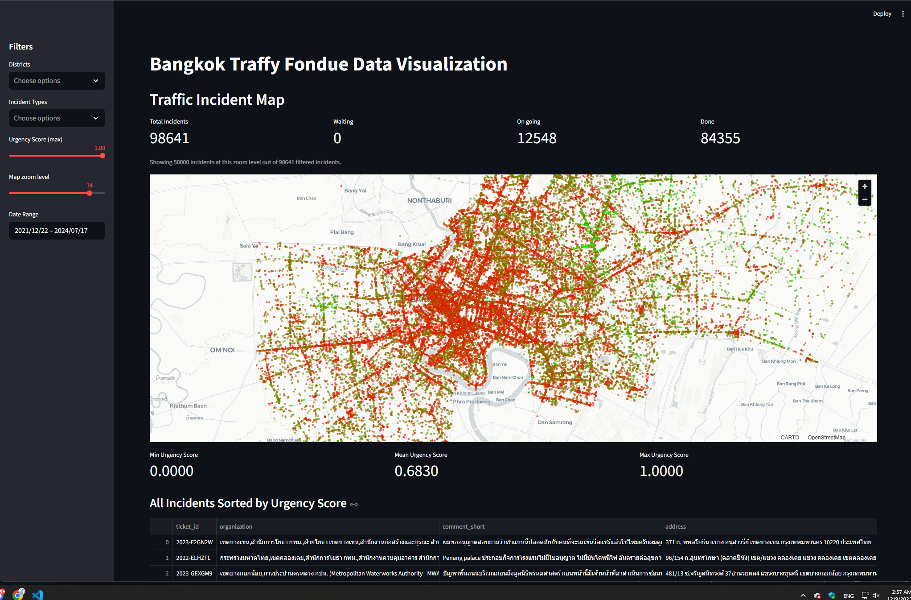
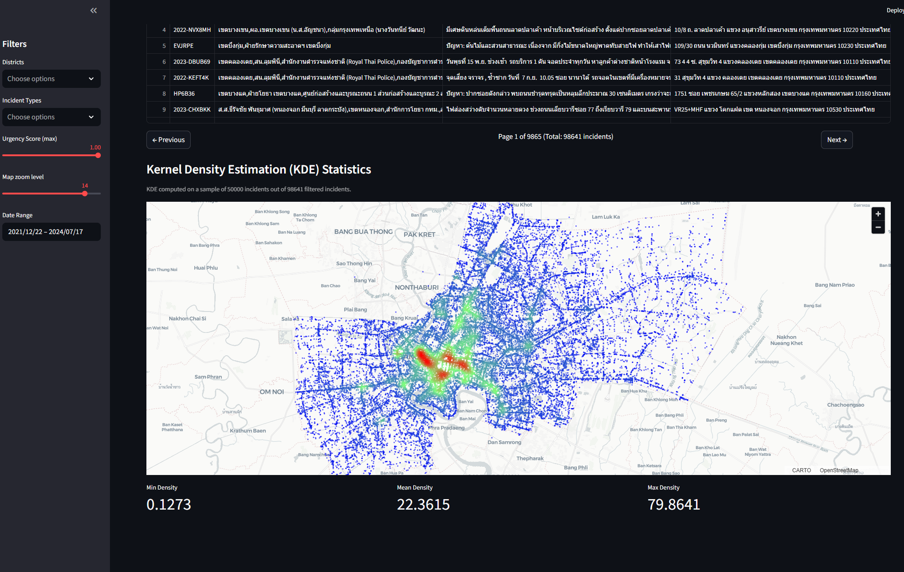

# Urban Problem Priority Recommender  
**Using Urban Issue Reports (Traffy Fondue Dataset)**

## Project Overview
Urban Problem Priority Recommender is an end-to-end system that prioritizes urban issues reported by citizens using the Traffy Fondue dataset. The system ranks problems based on **severity, urgency, location risk, and incident frequency**, and presents the results through an interactive visualization dashboard.

## Key Features
- Multi-factor urban problem prioritization
- Interactive map-based visualization
- Traffic incident distribution and urgency analysis
- Kernel Density Estimation (KDE) for hotspot detection

## Visualization Examples
### Traffic Incident Map

### KDE Heatmap

## Video Presentation
https://youtu.be/wypN5l7B1CQ

